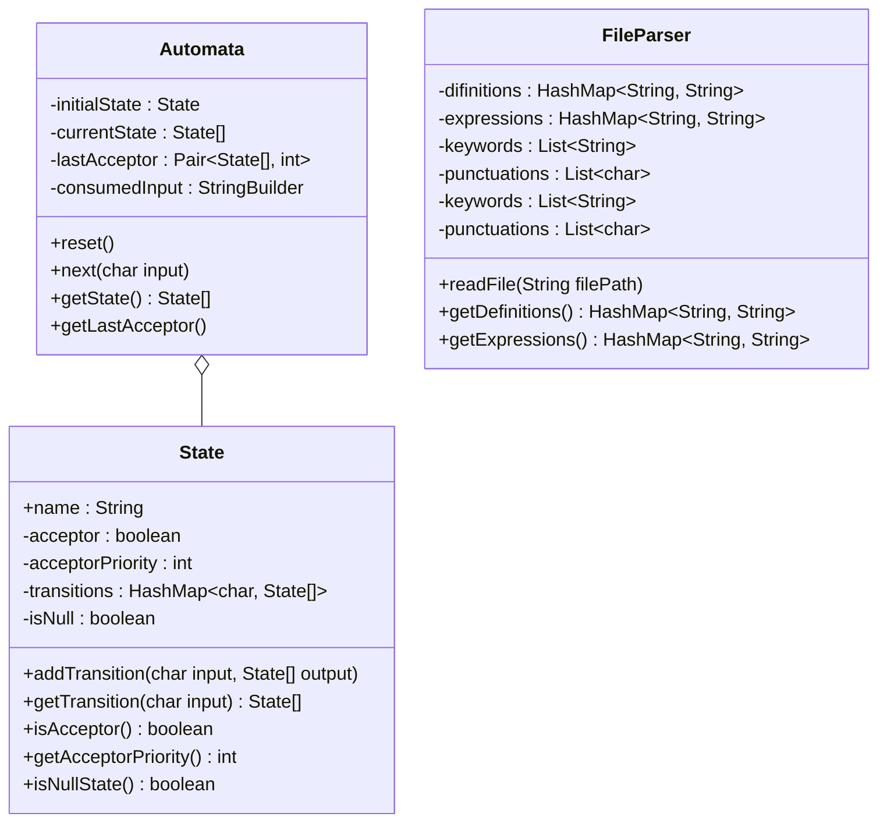
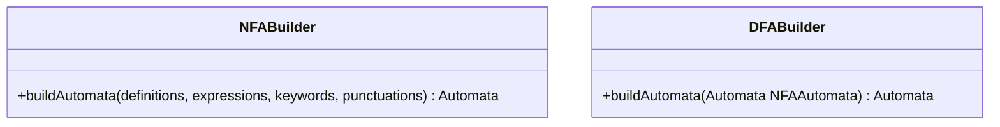

# Lexical rules representation
The implemented generator will be given the rules of the language in a file. An example file is present in [Phase 1](./Phase%201.pdf)  
Here is an example:  
letter = a-z | A-z  
digit = 0-9  
id: letter (letter|digit)*  
digits = digit+
{boolean float int}
num: digit+ | digit+ . digits(\L | E digits)

# Class Diagram

